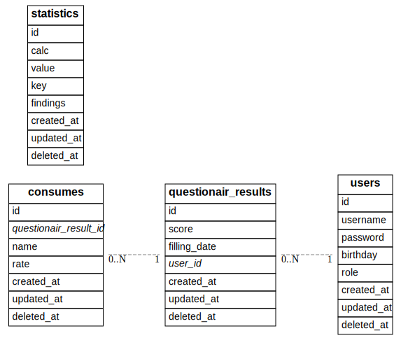

# RZ_STUD
A neat little school project with the goal of learning database-integration into a server-application.
The name has no meaning whatsoever.

## Building from source
### Prerequisites
* docker
* docker-compose (Kubernetes planned)
* make
### Building
```bash
make docker-build
```
## Starting the application
```bash
make up
```

## Components
### Postgres
Just an basic instance of postgres.
All application state is inside this database.
#### Schema
The schema is auto-migrated by the gorm ORM.
.
### Server
The REST-Backend of this app.  
#### Configuration:  
Configuration is done via environment variables.
| Variable | Example |
| --- | --- |
| STUDRZ_DBPASSWORD | mysecretpassword |
| STUDRZ_DATABASE | study |
| STUDRZ_DBUSER | rzstud |
| STUDRZ_DBHOST | db |
| STUDRZ_DBPORT | 5432 |
| STUDRZ_DBSSL | false |
| STUDRZ_TIMEZONE | Europe/Berlin |
| STUDRZ_ADMINPASSWORD | start-123 |
| * JAEGER_AGENT_HOST | deploy_jaeger-agent_1 |
| * JAEGER_AGENT_PORT | 6831 |
```*``` Optional for Jaeger tracing
#### API Docs
_still in construction_
### UI
A user-friendly React-app.
_Still in construction_
```bash
cd ui; 
npm start
```